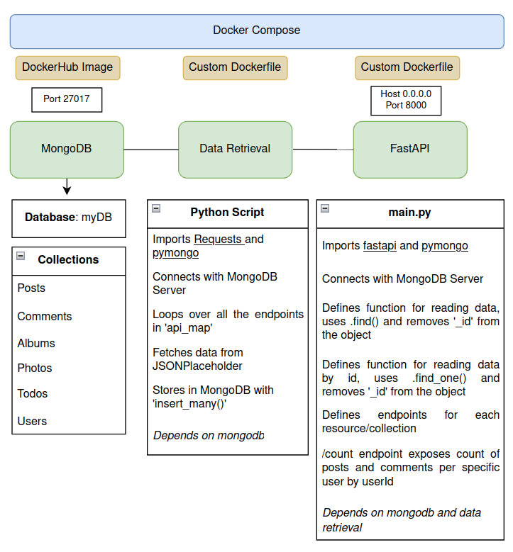

# Task 1
## Data Engineering and API Development Excercise

[Installation instructions](docs/install.md)  
[Technical Documentation](docs/documentation.md)  

### Overview
Develop a pipeline that involves setting up a MongoDB database using Docker Compose, retrieving and storing data from an external API, and exposing this data through FastAPI.

